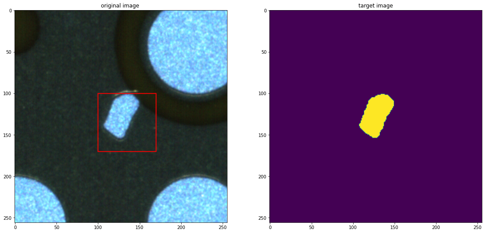
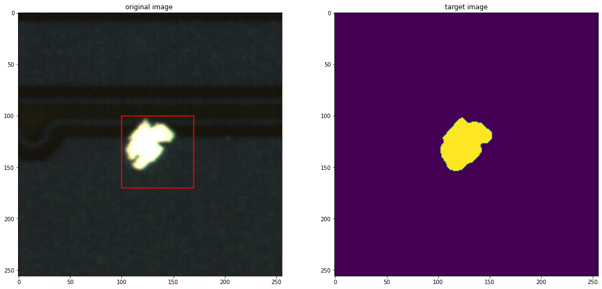

# GraphCut4ManufacturingDefects

Implementation of GrabCut algorithm for manufacturing defect detection and segmentation using OpenCV.

## Overview

This project uses the GrabCut algorithm from OpenCV to segment and isolate manufacturing defects in images. The implementation focuses on automatically separating defect regions from the background, which is particularly useful in quality control applications for manufacturing processes.

## Sample Results

Here are some example results from the defect segmentation process:





## Features

- Automated defect segmentation using GrabCut algorithm
- Region of interest (ROI) specification for targeted analysis
- Visualization of both original and segmented images
- Support for processing multiple defect images

## Algorithm Details

The code implements the following key steps:
1. Image loading and preprocessing
2. Initialization of mask and models for GrabCut
3. Definition of ROI rectangle for defect isolation
4. Execution of GrabCut algorithm (with 9 iterations)
5. Mask generation to identify foreground (defect) and background regions
6. Visualization of the results (original image with ROI and segmented defect)

## How It Works

The GrabCut algorithm uses a statistical approach to segment images by:
- Creating initial foreground/background models based on the user-defined rectangle
- Iteratively refining these models to improve segmentation
- Classifying each pixel as either foreground (defect) or background
- Using a graph cut optimization technique to find the optimal segmentation

## Requirements

- Python 3.x
- OpenCV
- NumPy
- Matplotlib

## Usage

1. Place your defect images in the same directory as the script
2. Uncomment the image file you want to process
3. Adjust the `rect` parameter as needed for your specific images
4. Run the script:
   ```
   python graphcut_defect_segmentation.py
   ```
5. The script will display the original image with ROI rectangle and the segmented defect

## Sample Images

The script includes references to multiple defect images (currently commented out), including:
- NG(97)(151).png
- NG(98)(91)(1).png
- Various NG(99) series images

Uncomment the appropriate line to use a specific image.

## Parameters

- `rect`: Defines the region of interest (x, y, width, height)
- GrabCut iterations: Currently set to 9 for optimal segmentation

## License

[MIT License](LICENSE)

## Author

[bemoregt](https://github.com/bemoregt)
